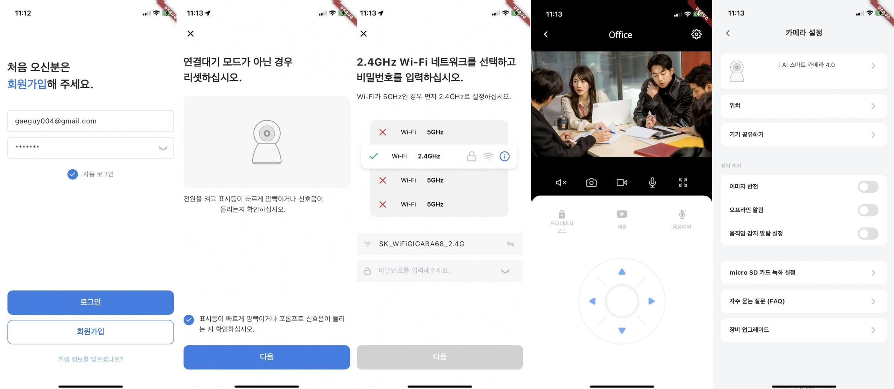

# Tuya Flutter SDK 
This is an unofficial Flutter SDK for developing the Tuya Smart Life App. It provides overall functionality for Smart Life App development, and additional features can be added upon request if needed.

## Supported Platforms


- Android
- iOS
## Screenshots




## Supported Features


It provides overall functionality for implementing the Tuya Smart IPC app, including:

- User Account
- Home Management
- Device Pairing
- Device Management
- Control Specific Devices

## Documentation


Detailed technical documentation is provided along with the source code.

## Example


Here, we cover the basic usage.

### App Initialization


```dart
TuyaSmartSdk homeSdk = TuyaSmartSdk();
homeSdk.initWithKey(
    'x4ehq5med3qg3dkmu3d5',
    '4h59f5uu99w79mckmf9m7dptgdtntt5x'
); // iOS app Key, secret
```

- In the above code, only the iOS key is set.
- The Android key is configured to be read from the manifest.

### Request Verification Code (Email)


```dart
TuyaSmartUser tuyaUser = TuyaSmartUser();
await tuyaUser.sendVerifyCodeWithEmail(
    user.email, 
    user.region, 
    "82",
    TuyaSmartUserEmailType.VERIFICATION_LOGIN
);
```

### Verify Verification Code (Email)
```dart
TuyaSmartUser tuyaUser = TuyaSmartUser();
await tuyaUser.checkCodeWithEmail(
    user.email, 
    user.region, 
    "82",
    code, // The verification code received via email 
    TuyaSmartUserEmailType.VERIFICATION_LOGIN
);
```

### Register
```dart
TuyaSmartUser tuyaUser = TuyaSmartUser();
await tuyaUser.registerWithEmail("82", user.email, user.password, code);
```

### Login
```dart
TuyaSmartUser tuyaUser = TuyaSmartUser();
await tuyaUser.loginWithEmail("82", user.email, user.password);
```

### Home List
```dart
TuyaSmartHomeManager tuyaHomeManager = TuyaSmartHomeManager();
List<HomeBean> list = await tuyaHomeManager.getHomeList();
```

### Home Details
```dart
TuyaSmartHome tuyaHome = TuyaSmartHome();
HomeBean home = await tuyaHome.getHomeDetail(homeId); // homeId is int
```

### Camera Pairing
```dart
TuyaSmartActivator activator = TuyaSmartActivator();
String token = await activator.getActivatorToken(homeId);
activator.startConfigWiFi(
      TYActivatorMode.TYActivatorModeQRCode,
      ssid,
      password,
      token,
      100,
    );
// To stop pairing, use activator.stopConfigWiFi();
```

- Cameras are paired using QR codes. Android or iOS generates QR information from the currently connected Wi-Fi information, and the camera pairs by reading the QR code. The above process is provided as an example.
- Callback functions received through TuyaSmartCameraActivatorListener are as follows:

```dart
void onQRCodeSuccess(String qrcodeUrl) {}
void onActiveSuccess(DeviceBean deviceBean) {} 
void onActiveFailed(String message) {}
```

### Camera Control

Camera control provides many features, including.

- `PreView` Play and stop the current recording video stream, take screenshots, save videos to the album, etc.
- `Playback` Play, stop, resume, pause recorded videos, and view videos from specific dates.
- `Download` Download recorded videos.
- Up, down, left, right camera movement
- Flip camera left and right
- Change camera quality
- Audio dialogue
- sdcard information and settings, etc.

## Sign a contract

- If you tell us the list of features you want and the package name, we will create it for you. Production time is within 3 business days, but costs will apply.
    - The cost is equivalent to two weeks' salary of the developer.
    - We provide SDK, Document, and Example App.
- You can either outsource the Tuya Flutter project you want to work on, or hire me to work with you.
- Please contact us at oojooteam@gmail.com
 
