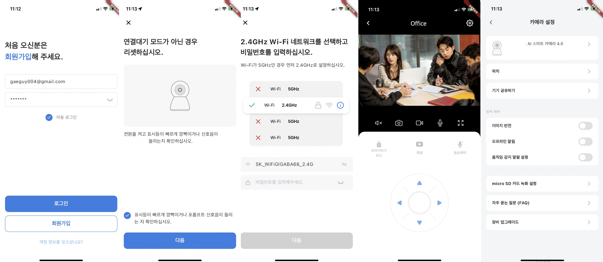

# Tuya Flutter SDK (1)

Tuya Smart Life App 개발을 위한 비공식 Flutter SDK 입니다. Smart Life App 개발을 위한 전반적인 기능을 제공하며, 다른 Tuya SDK가 필요하실 경우 요청하시면 추가 기능 제공이 가능합니다.

## 지원되는 플랫폼


- Android
- iOS

## 스크린샷




## 지원하는 기능


Tuya Smart IPC 앱 구현을 위한 전반적인 기능을 제공합니다. 

- `[User Account](https://developer.tuya.com/en/docs/app-development/usermanage?id=Ka69qtzy9l8nc)`
- `[Home Management](https://developer.tuya.com/en/docs/app-development/homemanage?id=Ka6kjkgere4ae)`
- `Device Pairing`
- `Device Management`
- `Control Specific Devices`

## Document


자세한 기술문서는 소스코드와 함께 제공됩니다.

## Example


여기서는 기본적인 사용법을 다룹니다. 

### 앱 초기화


```dart
TuyaSmartSdk homeSdk = TuyaSmartSdk();
homeSdk.initWithKey(
	'x4ehq5med3qg3dkmu3d5',
	'4h59f5uu99w79mckmf9m7dptgdtntt5x'
); //ios app Key, secret
```

- 위 코드에서는 iOS 키만 설정합니다.
    - Android 키는 manifest 에서 읽어오도록 설정되있습니다.

### 인증번호 요청 (이메일)


```dart
TuyaSmartUser tuyaUser = TuyaSmartUser();
await tuyaUser.sendVerifyCodeWithEmail(
	user.email, 
	user.region, 
  "82",
	TuyaSmartUserEmailType.VERIFICATION_LOGIN
);
```

### 인증번호 인증 (이메일)


```dart
TuyaSmartUser tuyaUser = TuyaSmartUser();
await tuyaUser.checkCodeWithEmail(
	user.email, 
	user.region, 
  "82",
	code, //이메일로 받은 인증번호 
	TuyaSmartUserEmailType.VERIFICATION_LOGIN
);
```

### 회원가입


```dart
TuyaSmartUser tuyaUser = TuyaSmartUser();
await tuyaUser.registerWithEmail("82", user.email, user.password, code);
```

### 로그인


```dart
TuyaSmartUser tuyaUser = TuyaSmartUser();
await tuyaUser.loginWithEmail("82", user.email, user.password);
```

### Home 리스트


```dart
TuyaSmartHomeManager tuyaHomeManager = TuyaSmartHomeManager();
List<HomeBean> list = await tuyaHomeManager.getHomeList();
```

### Home 상세


```dart
TuyaSmartHome tuyaHome = TuyaSmartHome();
HomeBean home = await tuyaHome.getHomeDetail(homeId); // homeId is int
```

### 카메라 페어링


```dart
TuyaSmartActivator activator = TuyaSmartActivator();
String token = await activator.getActivatorToken(homeId);
activator.startConfigWiFi(
      TYActivatorMode.TYActivatorModeQRCode,
      ssid,
      password,
      token,
      100,
    );
//acitvator.stopConfigWiFi(); 페어링을 중단할 경우
```

- 카메라는 QR 로 페어링을 합니다. Android 또는 iOS에서 현재 연결된 Wifi 정보를 QR 정보로 만들고, 카메라에서는 해당 QR를 읽는 방식으로 페어링이 됩니다. 위 과정은 예제로 제공합니다.
- `TuyaSmartCameraActivatorListener` 을 통해 전달받는 콜백함수는 아래와 같습니다.

```dart
void onQRCodeSuccess(String qrcodeUrl) {}
void onActiveSuccess(DeviceBean deviceBean) {} 
void onActiveFailed(String message) {}
```

### 카메라 조작


카메라 조작에는 많은 기능들이 제공됩니다. 제공되는 기능은 아래와 같습니다.

- `PreView` 현재 녹화되는 영상의 송출 play, stop
    - 스크린 샷, 앨범에 동영상 저장 등
- `Playback` 녹화된 영상 play, stop, resume, pause
    - 특정 날짜 영상 돌려보기
- `download` 녹화되는 영상의 다운로드
- 상, 하, 좌, 우 움직임
- 카메라 반전
- 오디오 대화 등


## 유료입니다

- 원하는 기능 리스트와 패키지명을 말씀해주시면 제작해드립니다. 제작기간은 3 영업일 이내로 드리며, 비용이 발생합니다.
    - 비용은 개발자의 2주치 급여에 해당합니다.
    - SDK, Document, Example App을 드립니다.
- 진행하려는 Tuya Flutter Project에 외주를 주거나, 저를 고용하여 함께 일하는 형태도 가능합니다.
- oojooteam@gmail.com 으로 연락주세요.


SDK, Example App 은 모두 제공합니다. 제공받기 위해서는 oojooteam@gmail.com 으로 연락주세요.
